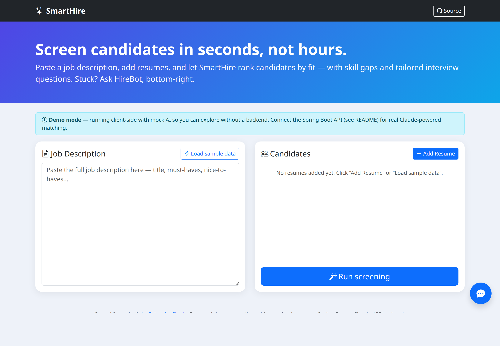
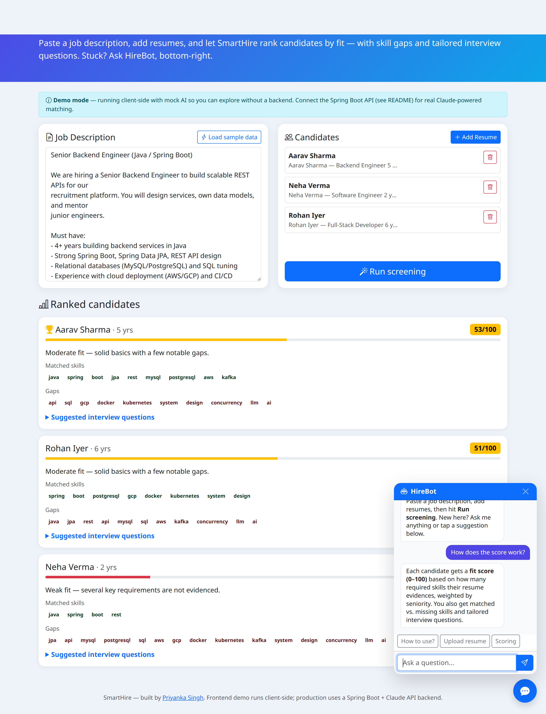

# SmartHire — AI Resume Screening Assistant

**🔗 Live demo:** https://priyanka-ns.github.io/smarthire/

Paste a job description, add candidate resumes, and SmartHire ranks candidates by
fit — with matched skills, gaps, and tailored interview questions. A built-in
**HireBot** chatbot guides users through the flow and answers their questions.

> The public demo runs **client-side with mock AI** so it's fully clickable without
> an API key. Connect the Spring Boot backend (below) with a Claude API key to get
> **real Claude-powered** semantic matching and chat.

## Screenshots

**Landing — paste a JD and add candidates**


**Screening results + HireBot assistant**


---

## Features

- **AI candidate ranking** — each resume gets a 0–100 fit score against the JD.
- **Skill extraction & gap analysis** — matched vs. missing skills per candidate.
- **Auto-generated interview questions** tailored to each candidate's gaps.
- **HireBot assistant** — a floating chatbot that walks users through pasting a JD,
  uploading resumes, and reading the results.
- **Demo mode** — works with no backend so it can live on GitHub Pages; auto-switches
  to the real API when configured.

## Architecture

```
Frontend (docs/)                 Backend (backend/)
Bootstrap + vanilla JS           Spring Boot 3 (Java 17)
├─ index.html                    ├─ POST /api/match  → rank resumes vs JD
├─ js/app.js    (UI logic)       ├─ POST /api/chat   → HireBot replies
├─ js/api.js    (calls backend   ├─ POST /api/health
│                or demo mode)    └─ Anthropic Java SDK → Claude (claude-opus-4-6)
├─ js/chatbot.js (HireBot)
└─ js/mockdata.js (demo AI)
        │
        └── GitHub Pages (static, live now)
```

The frontend calls the backend when a URL is configured
(`window.SMARTHIRE_API` in `docs/index.html`, or `?api=<url>` in the URL);
otherwise it falls back to demo mode.

## Tech Stack

| Layer     | Technology                                            |
|-----------|-------------------------------------------------------|
| Frontend  | HTML, Bootstrap 5, vanilla JS (no build step)         |
| Backend   | Java 17, Spring Boot 3, Spring Web + Validation       |
| AI        | Anthropic Claude via the official `anthropic-java` SDK |
| Deploy    | GitHub Pages (frontend), Docker / Render (backend)    |

---

## Run the backend locally

**Prerequisites:** JDK 17+, Maven, and a Claude API key from
[console.anthropic.com](https://console.anthropic.com/).

```bash
cd backend
cp .env.example .env            # then edit .env and add your key
export ANTHROPIC_API_KEY=sk-ant-...    # or use your .env loader
./mvnw spring-boot:run          # or: mvn spring-boot:run
```

The API starts on `http://localhost:8080`. Quick check:

```bash
curl localhost:8080/api/health
```

Then open the frontend with the backend wired in:

```
docs/index.html?api=http://localhost:8080
```

(or uncomment the `window.SMARTHIRE_API` line in `docs/index.html`).

## Deploy the backend (make the live demo "real")

**Option A — Render (Docker blueprint):**
1. Push this repo to your GitHub (done).
2. In Render: **New → Blueprint**, select this repo (it reads `render.yaml`).
3. Set the `ANTHROPIC_API_KEY` secret in the dashboard.
4. After deploy, copy the service URL and set it as `window.SMARTHIRE_API`
   in `docs/index.html`, or open `…/smarthire/?api=<your-render-url>`.

**Option B — any Docker host:**
```bash
cd backend
docker build -t smarthire-backend .
docker run -p 8080:8080 -e ANTHROPIC_API_KEY=sk-ant-... smarthire-backend
```

## API

| Method | Path          | Body                                             | Returns |
|--------|---------------|--------------------------------------------------|---------|
| POST   | `/api/match`  | `{ jobDescription, resumes: [{name, text}] }`    | ranked `results[]` + `jdSkills[]` |
| POST   | `/api/chat`   | `{ message, history: [{role, content}] }`        | `{ reply }` |
| GET    | `/api/health` | —                                                | `{ status }` |

## Security notes

- The Claude API key is read from the `ANTHROPIC_API_KEY` environment variable and
  is **never** committed. `.env` is git-ignored.
- Because a public static site can't safely hold an API key, the GitHub Pages demo
  intentionally uses mock responses — real AI only runs through the backend.
- CORS origins are configurable via `CORS_ALLOWED_ORIGINS` (lock this to your Pages
  URL in production).

## Author

Built by [Priyanka Singh](https://github.com/priyanka-ns).
